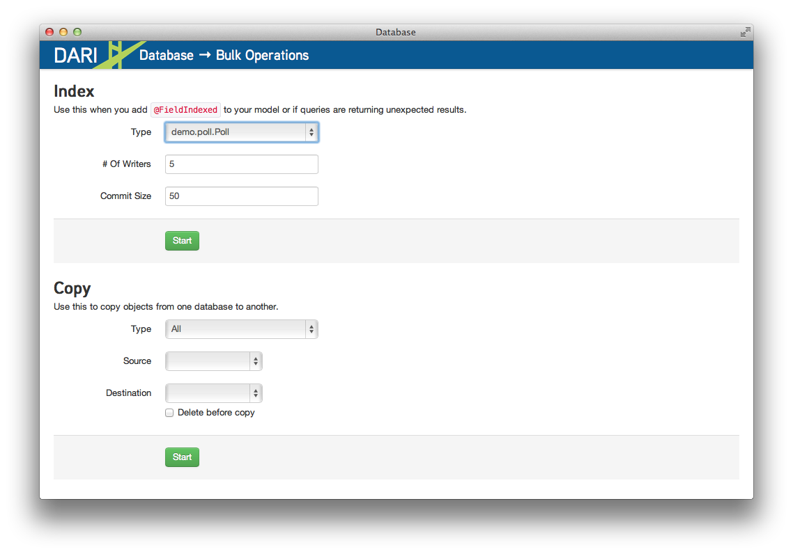

## Data Modeling

All models in Dari extend from
[com.psddev.dari.db.Record](javadocs/index.html?com/psddev/dari/db/Record.html).
Unlike traditional ORMs Dari does not map objects to database tables. Instead it
serializes object data into JSON and stores it in the database as a BLOB. This
frees developers from worrying about creating or altering database tables and
allows for rapid evolution of data models.

All fields in a class that extends `com.psddev.dari.db.Record` are
persisted to the database when the object is saved. To prevent a field
from being persisted mark it as `transient`.

Here is an example data model of an article with an author:


import com.psddev.dari.db.Record;
import com.psddev.dari.db.ReferentialText;

public class Article extends Record {
    @Indexed private Author author;
    @Indexed private String title;
    private ReferentialText body;

    // Getters and Setters
}



import com.psddev.dari.db.Record;

public class Author extends Record {
    private String name;
    @Indexed private String email;

    // Getters and Setters
}


### Indexes

In order to query an object by one of its fields the fields must be marked
with the `@Index` annotation.  This lets Dari know that these fields can be
queried against. Without this annotation Dari will not allow queries against a field.

    <strong>Performance Tip:</strong>
    
Every field marked with an index will be an cause an additional
    row to be written to the underlying database index tables when using 
    a SQL database backend.

Sometimes it is necessary to add indexes to existing models that already
have data. Just like a traditional SQL databases this requires the
index to be filled for all the existing data. In Dari there is a Bulk
Operations tool to help manage this at `/_debug/db-bulk`. This tool will
re-index all instances of a selected model.

After starting a bulk operation it's progress can be monitored on the
Task Manager page (`/_debug/task`).

See the [Configuration](configuration.html#debug-tools) section of the documentation for information on
how to configure the debug tools.

### Collections

Collections (e.g List, Set, etc) are automatically handled by Dari. No
extra tables or information is needed.

For example we can add a `Tag` model and add a list of tags to the
`Article` class from above:


import com.psddev.dari.db.Record;

public class Tag extends Record {
    private String name;

    // Getters and Setters
}



import com.psddev.dari.db.Record;
import com.psddev.dari.db.ReferentialText;

public class Article extends Record {
    @Indexed private Author author;
    @Indexed private String title;
    private ReferentialText body;
    private List<Tag> tags;

    // Getters and Setters
}


    <strong>Performance Tip:</strong>
    
Indexes on collections are also supported. However, performance should be
    considered when adding indexes to collections. Each item in a
    collection will result in an additional row to be written to the underlying database
    index tables when using a SQL database backend.

    
Also be careful that your collections do not grow unbounded. Large
    collections can slow down retrieval of data since Dari will
    retrieve the collection data even if you don't need it.

### Relationships

Relationships are resolved automatically. Dari will lazy load referenced
objects when they are first accessed.

### Embedded Objects

Objects can be marked embedded using the `@Embedded` annotation. This
causes the objects data to be stored inline with the parent object.

### Schema Viewer

When Dari is used in a J2EE project it provides a tool to visualize your data
model. It automatically updates with change to the data model. The
schema viewer can be found at `/_debug/db-schema`.

See the [Configuration](configuration.html#debug-tools) section of the documentation for information on
how to configure the debug tools.

### Saving With Dari Objects

To save a Dari object to the underlying database storage call the
[save()](javadocs/com/psddev/dari/db/Record.html#save%28%29) method on the object.

    Image image = new Image();
    image.setName("name");
    image.save();

    Article article = new Article();
    article.setArticle(article);
    article.setTitle("This is the Article Title");
    article.setBody("<h1>This is the Body Text</h1>");
    article.setImage(image)
    article.save();

To delete a Dari object fro the underlying database storage call the
[delete()](javadocs/com/psddev/dari/db/Record.html#delete%28%29) method on the object.

